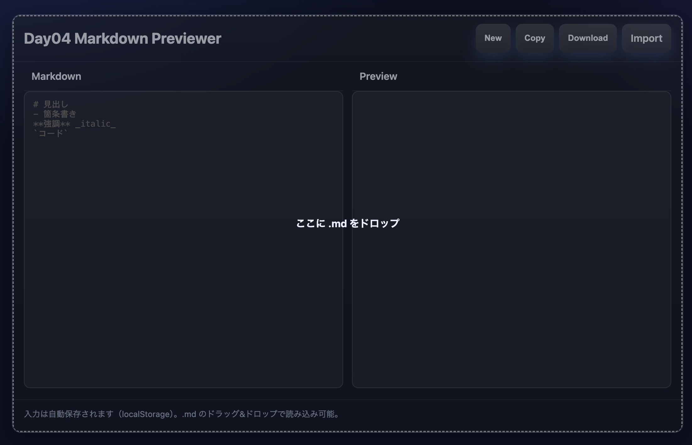

# Day04 Markdown Previewer 📝

100日チャレンジ（AI × Webアプリ開発）の Day 4 作品です。  
シンプルな **Markdownプレビューア** で、左に Markdown を入力すると右側にリアルタイムでプレビューが表示されます。  
入力は自動保存され、.md ファイルの読み込みやダウンロード、コピーにも対応しています。  

---

## 🚀 Demo
👉 [公開ページはこちら](https://fsonhub-bit.github.io/day04-markdown/)

---

## 📖 使い方
1. 左側のエディタに Markdown を入力  
2. 右側にプレビューがリアルタイムで表示されます  
3. 上部のボタンで以下が可能です  
   - **New**: 入力内容をクリア  
   - **Copy**: Markdown テキストをコピー  
   - **Download**: `.md` ファイルとして保存  
   - **Import**: `.md` ファイルを読み込む  
   - ドラッグ&ドロップで `.md` ファイルを読み込むことも可能  

---

## 💡 学んだこと
- Markdown を **基礎的な記法だけ軽量パーサで実装**する方法  
- `localStorage` を使った **自動保存と復元**  
- `Blob` を使って `.md` ファイルとして **ダウンロード**する仕組み  
- ドラッグ&ドロップ API を使った **ファイル読み込み**  

---

## 🔧 改善したいこと
- GFM（GitHub Flavored Markdown）対応（表・チェックリストなど）  
- シンタックスハイライト付きコードブロック  
- HTML / PDF 出力機能  
- モバイル画面でのレイアウト調整  

---

## 📝 License
MIT